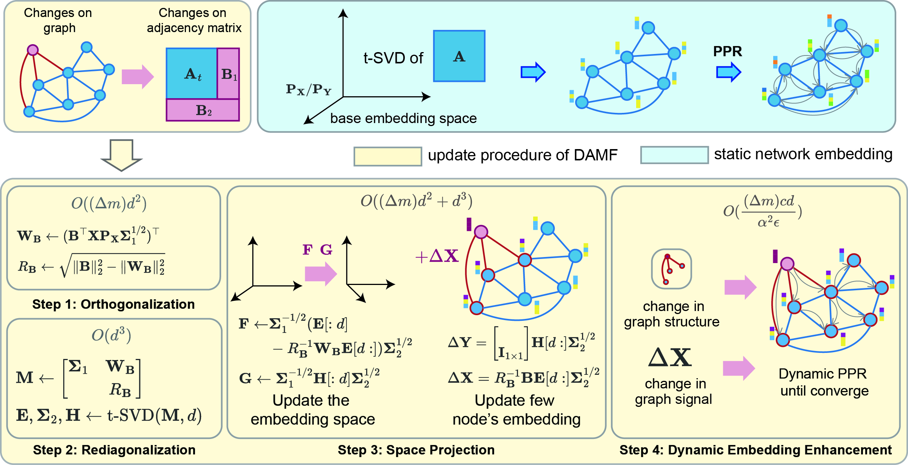

# DAMF: Dynamic Network Embedding in Milliseconds

[](https://arxiv.org/pdf/2306.08967.pdf)[](https://dl.acm.org/doi/abs/10.1145/3580305.3599250)

Hi, here is the code implement for the paper "Accelerating Dynamic Network Embedding with Billions of Parameter Updates to Milliseconds" accepted by **KDD2023** .

<div align=center title="Overview"> 
  
</div>

**DAMF** is a dynamic network embedding algorithm by dynamically maintaining a rank-$d$ truncated SVD of adjacency matrix of dynamic graph and a dynamic $\epsilon$​-PPR. Specifically, changes in graph (e.g. changes of node or changes of edge) can be recognized as changes in the adjacency matrix of the graph. 

A dynamic SVD method based on *Zha-Simon's approach* is used to maintain a rank-$d$ matrix factorization of the adjacency matrix, and from this a $d$-dimensional representation of each node can be obtained. Then a dynamic *Personalized PageRank* graph propagation process enhances this d-dimensional representation to capture higher-order neighbor information.

**(March 2024) Update: Recently we released [IncSVD](https://github.com/HaoranDeng/IncSVD), a new python toolkit for dynamic SVD.**

In this code repository we provide:

- **DAMF**: A runnable code for DAMF. This includes,  the full version of DAMF (`DAMF.py`), which requires a more complex setup process, and a basic version without the PPR enhancements (`DAMF_unenhanced.py`).

- **Datasets**: Some of the datasets used for the experiments in our paper. As the datasets used in our experiments are large, due to the space limit, we have only included a small part of datasets.

- **Evaluator**: Code for generating training and test data, as well as code for measuring node classification, link prediction and graph reconstruction tasks.

- **Baseline replicated by us**: As we did not find the code for LocalAction, we replicated it ourselves in python, which will also be made public here.

## Setup

We are using Python version **3.9.12** and install the dependency packages with the following command:

```shell
pip install -r requirements.txt
```

If you do not require dynamic embedding enhancements, you only need to install the following Python dependency packages. Otherwise, you will need to install Boost and compile the dynamic embedding enhancement module. To install the dynamic embedding enhancement module, you may need to make sure that **C++**, **cmake** and **BLAS** (e.g. OpenBLAS) are already installed. 

Install Boost and BLAS:

```shell
sudo apt-get update
sudo apt-get install libboost-all-dev
sudo apt-get install cblas
```

Compile the dynamic embedding enhancement module:

```shell
mkdir build
cd build
cmake ..
make
cd ..
```

## Quick-Start.

If everything is ready, you may try the following demo.

```shell
sh run_wiki.sh
```

In this demo we initialize the dataset ***wiki*** (in `data/wiki`) with 1000 nodes and then add the rest of the nodes into the graph. A 128-dimensional network embedding is maintained. Then, we call `nc.py` to evaluate the network embedding maintained by DAMF (a.k.a. `damf1` in algo_list) with *Node Classification* task. 

## User Guide

### Input Format

The input should be a sparse matrix in `.mat` format. You can refer to the corresponding functions in `utils.py` for details.

### Run DAMF


```
python DAMF_unenhanced.py --data [data name] --type ["train", "full"]
```

You can use `--d` to adjust the embedding dimenspional (default is 128) and `--init` to adjust the initial number of nodes (default is 1000).

```
python DAMF.py --data [data name] --type ["train", "full"]
```

You can also use `--epsilon` and `--alpha` to adjust the hyperparameters for PPR.

### Evaluate

After ensuring that your embedding results have been saved in `embds/[algo]`, you can start the Evaluation process.

The code for the evaluation is stored under the folder `eval/`:

```
cd eval
```

Three evaluations of network embedding are supported, including **node classification** (`nc.py`), **link prediction** (`lp.py`) and **graph reconstruction** (`gr.py`).

```shell
# Node classification
python nc.py --data [data name] --algo [damf, damf1]

# Link prediction
python lp.py --data [data name] --algo [damf, damf1]

# Graph reconsturction
python gr.py --data [data name] --algo [damf, damf1]
```

### Baseline (LocalAction)

```
python LocalAction.py --data [data name] --type ["train", "full"]
```

```
python nc.py --data [data name] --algo la
```

In addition, if you want to evaluate other models, you need to add the model names to `eval/algo_list.py` first.

## Citations

If you find our work useful, please consider citing the following paper:

```react
@inproceedings{deng2023damf,
author = {Deng, Haoran and Yang, Yang and Li, Jiahe and Cai, Haoyang and Pu, Shiliang and Jiang, Weihao},
title = {Accelerating Dynamic Network Embedding with Billions of Parameter Updates to Milliseconds},
year = {2023},
booktitle = {Proceedings of the 29th ACM SIGKDD Conference on Knowledge Discovery and Data Mining},
pages = {414–425},
numpages = {12},
keywords = {graph representation learning, matrix factorization, network embedding, dynamic graphs},
location = {Long Beach, CA, USA},
}
```

